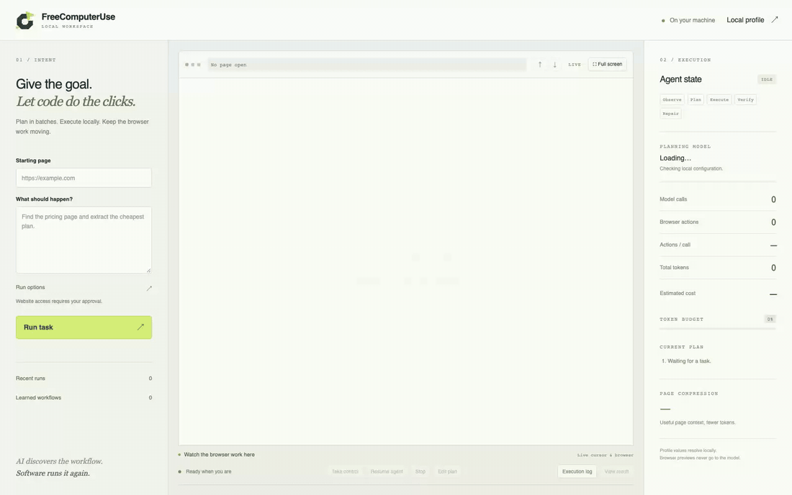
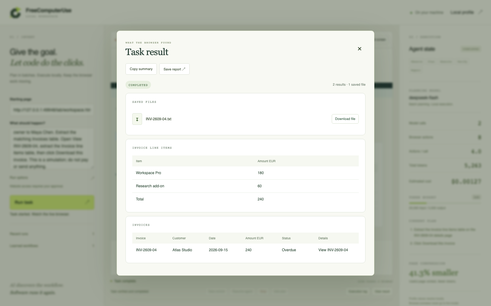
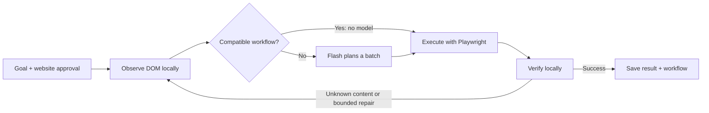

# FreeComputerUse


<p align="center">
  <a href="LICENSE"></a>
  
  
  
</p>

<p align="center">
  <a href="#quick-start">Get started</a> ·
  <a href="https://othmaneblial.github.io/FreeComputerUse/lab/index.html">Explore the free task lab</a> ·
  <a href="#measured-not-guessed">See the measurements</a> ·
  <a href="SECURITY.md">Security</a>
</p>

**Give your browser a goal. Watch the cursor move, click and type. Keep the workflow when it works.**

FreeComputerUse is a local browser agent that asks a configured language model to plan batches of actions, then executes and verifies them with TypeScript and Playwright. A compatible learned workflow can run again with **zero model calls**.

Research products, find an invoice, extract a dashboard or work through a multi-page task—with website approval, visible execution and the ability to take control.

**MIT-licensed software. Bring your own model API key; API usage is billed by your provider.** The browser, profiles and history stay on your machine. Selected webpage context goes to the configured model API.

## See it work

[](https://othmaneblial.github.io/FreeComputerUse/lab/index.html#watch)

**One goal → six pages → a checked incident brief.** Watch the cursor follow the alert, timeline, metrics, deployment comparison and runbook before completing the synthetic brief.

This is one continuous, unsped dashboard recording with real DeepSeek Flash planning and Playwright actions. Normal mode asks before website access and before the synthetic brief is saved; the capture harness approves only that practice origin and local save. The downloaded file is checked against the incident evidence; no production system is changed.

This filmed run completed with **21 successful browser actions, 10 model calls and 32,053 tokens**; it recovered from one failed action in four repair batches. The configured price estimate was **$0.00650** (not a provider invoice).

[Watch the video on the site](https://othmaneblial.github.io/FreeComputerUse/lab/index.html#watch) · [Open the MP4](docs/lab/media/incident-demo.mp4) · [Inspect this run’s evidence](assets/readme/incident-evidence.json) · [Read the downloaded brief](assets/readme/INC-204-incident-brief.txt)

<details>
<summary><strong>Another recorded task: find and download an invoice</strong></summary>



**Four filters → a separate invoice page → two extracted tables → a verified download.** That run used 8 browser actions, 2 model calls and 5,263 tokens, with no repairs. [Watch its full recording](assets/readme/demo.mp4) · [Inspect its evidence](assets/readme/demo-evidence.json).



Results are readable tables, facts and saved files. Copy a summary or save a standalone HTML report. The execution stream opens when you need it; fullscreen lets you focus on the browser.

</details>

## Why this approach?

| What you want | What the runtime does |
| --- | --- |
| An agent you can actually watch | Streams the real browser with a visible pointer, progressive typing, clicks and scrolling |
| Model calls spent on decisions | Plans action batches; handles selectors, execution and checks locally |
| Less planning for repeat work | Saves successful semantic workflows and reuses compatible ones without a model |
| A way out when things go wrong | Pauses for manual control or plan editing; uses bounded repairs and stops at configured limits |
| Evidence you can inspect | Records actions, outcomes, model calls, tokens, repairs and configured cost estimates |
| Permission before access | Normal mode asks before the first document request to each website origin |

The planner sees compressed DOM and control context. **Preview screenshots are not sent to the model.** This is browser automation for accessible web pages; visual-only canvas and desktop OS control are outside the current scope.

## Quick start

Requires **Node.js 22.13+**, npm and Playwright’s Chromium. Tested on macOS.

```bash
git clone https://github.com/OthmaneBlial/FreeComputerUse.git
cd FreeComputerUse
npm ci
npx playwright install chromium
cp .env.example .env
chmod 600 .env
```

Edit `.env` locally:

```dotenv
LLM_API_KEY=your-api-key
LLM_MODEL=deepseek-flash
LLM_BASE_URL=https://api.deepseek.com
LLM_RESPONSE_FORMAT=json_object
```

```bash
npm run dev
```

Open **http://127.0.0.1:4318**. Paste the URL and goal below, click **Run task**, then approve website access.

**Starting page**

```text
https://othmaneblial.github.io/FreeComputerUse/lab/workspace.html?view=billing
```

**What should happen?**

```text
Search invoices for Atlas Studio. Set Invoice status to Overdue,
Invoice period to September 2026, and Account owner to Maya Chen.
Extract the matching Invoices table. Open View INV-2609-04,
extract the Invoice line items table, then click Download this invoice.
This is a simulation; do not pay or send anything.
```

Check for **INV-2609-04**, **Atlas Studio** and line items totalling **EUR 240**. The download contains the same synthetic invoice. Repeat the same goal from the same starting URL to try learned workflow reuse.

**Want a first run without an API key?** Open [the revenue table](https://othmaneblial.github.io/FreeComputerUse/lab/reports.html) with the exact goal `Extract the table`. This narrow task has a deterministic local strategy. General tasks need a configured provider.

<details>
<summary><strong>Provider configuration and budgets</strong></summary>

DeepSeek Flash is the live-validated default. Other providers have not been live-validated here. Set `LLM_PROVIDER=openai-compatible` for services that implement OpenAI Chat Completions, or `LLM_PROVIDER=anthropic` for Anthropic’s Messages API.

| Service | Settings |
| --- | --- |
| OpenAI API | `LLM_PROVIDER=openai-compatible`, `LLM_BASE_URL=https://api.openai.com/v1`, `LLM_MODEL=<model>` |
| xAI Grok | `LLM_PROVIDER=openai-compatible`, `LLM_BASE_URL=https://api.x.ai/v1`, `LLM_MODEL=<model>` |
| OpenRouter or another compatible endpoint | `LLM_PROVIDER=openai-compatible`, set its base URL and model |
| Anthropic API | `LLM_PROVIDER=anthropic`, `LLM_MODEL=<model>`, `LLM_RESPONSE_FORMAT=json_object`; base URL defaults to `https://api.anthropic.com/v1` |

Set `LLM_API_KEY` to the key for that service. Anthropic uses JSON output plus local schema validation because its structured-output schema rules do not accept this app’s dynamic extraction fields. OpenAI API billing is [separate from a ChatGPT subscription](https://help.openai.com/en/articles/9039756-managing-billing-for-chatgpt-and-the-api-platform); Claude API usage is separate from a Claude Pro/Max plan.

| Setting | Default |
| --- | --- |
| `FCU_MAX_LLM_CALLS` | No total cap; set this only if you want one |
| `FCU_MAX_INPUT_TOKENS` | No total cap; set this only if you want one |
| `FCU_MAX_OUTPUT_TOKENS` | No total cap; set this only if you want one |
| `FCU_DATA_DIR` | `.fcu` |

Long tasks may use more model calls; the dashboard shows actual calls, tokens and estimated cost. Browser action, repair and loop guards still stop runaway execution. Optional `LLM_INPUT_PRICE`, `LLM_OUTPUT_PRICE` and `LLM_CACHED_INPUT_PRICE` are USD per million tokens. Leave prices blank to show unknown cost; estimates are not billing receipts. Check [current provider pricing](https://api-docs.deepseek.com/quick_start/pricing/) before setting them.

Verify the local browser and model endpoint with `npm run agent -- doctor --api`.

</details>

## Try something useful

The [task library](https://othmaneblial.github.io/FreeComputerUse/lab/index.html) has eight complex practice workflows and ten sourced real-world research goals. The practice site is free, styled and synthetic; changes stay in its browser session.

| Task | What makes it a useful test |
| --- | --- |
| Compare wireless keyboards | Search, combine filters, inspect a separate product page, compare two items and download evidence |
| Plan an accessible journey | Set dates and passengers, reveal preferences, compare routes, inspect details and save an itinerary across three pages |
| Retrieve an overdue invoice | Apply four filters, navigate to the invoice, extract line items and verify the saved file |
| Extract a scoped revenue report | Change quarter and channel, inspect a month’s breakdown and check exported totals |
| Update local preferences | Review changes, save them and verify persistence after reload |
| Find a document | Combine folder/format filters, preview the right document and check downloaded content |
| Reconcile a quarter close | Cross six real pages, compare revenue and booked ledger, inspect a pending adjustment and save a policy-consistent review dossier |
| Investigate an API incident | Filter alerts, inspect a timeline, compare before/after 429 rates and deployment configuration, then save an engineer review brief |

For read-only work beyond the lab, try [Books to Scrape](https://books.toscrape.com/) or the sourced public-data tasks in the library. **A researched example is not automatically a passed agent trial.** Cards and [the examples guide](docs/USEFUL_EXAMPLES.md) distinguish validated runs from untested goals.

```bash
# Real public scraping sandbox; no account or purchase.
npm run agent -- run \
  "Extract the full titles and prices of the first five books as structured records" \
  https://books.toscrape.com/
```

## Measured, not guessed

Recorded on **18 September 2026**, using real DeepSeek Flash calls:

| Focused public suite | First runs | Compatible learned repeats |
| --- | ---: | ---: |
| Independent correctness checks passed | **14 / 14** | **14 / 14** |
| Model calls | 18 | **0** |
| Total tokens | 31,654 | **0** |
| Successful browser actions | 30 | 30 |

First-run API usage was **approximately $0.00611 total** at the configured benchmark prices. Repeats ran with **no provider installed**. [Raw public report](artifacts/benchmark-public.json) · [Method and limitations](docs/BENCHMARKS.md).

These are single trials on specified automation sandboxes and project-owned pages, not a general website success rate. [All eight complex workflows](artifacts/benchmark-complex-authored.json) pass independent checks with authored plans and provider-free repeats. The new [quarter-close](artifacts/benchmark-complex-live-close.json) and [incident investigation](artifacts/benchmark-complex-live-incident.json) each also passed in one live Flash trial and then repeated with zero model calls. Authored plans validate execution and reuse, not model planning. Other live complex trials include failures. [Earlier live trial, including failures](artifacts/benchmark-complex-live-travel,billing.json) · [Read-only real-world trial](artifacts/benchmark-real-world.json).

An [open-ended incident prompt](docs/USEFUL_EXAMPLES.md) that omits the answer values also passed [one separate live trial](artifacts/benchmark-complex-live-incident-challenge.json) and then replayed with zero model calls. The report keeps this single run distinct from the guided trial.

No screenshot-agent baseline was measured, so we do not claim a token or cost savings percentage.

## Permission and control are part of the product

**Normal mode asks before accessing each website origin**, then separately gates sensitive actions. Learned workflows and replay retain those checks. Noninteractive CLI runs reject approval requests instead of silently allowing them.

Use **Take control** to pause, interact manually or edit the plan, then resume. Choose `--confirmation always` for action-by-action review. **Ultra mode is explicit and off by default**: it skips website/action approval and permits external HTTP(S) destinations, while retaining the fixed action API and configured limits.

The model cannot execute shell commands or arbitrary JavaScript. Profile values and upload paths resolve locally through explicit aliases. Known secret values are redacted, and webpage content is treated as untrusted data. Sensitive-action detection is heuristic; arbitrary webpage data may still be sent in model context.

Local `.env`, `.fcu`, sessions and downloads are ignored by Git and use restricted permissions. **Local storage is not encrypted.** The dashboard binds to loopback and uses a session cookie, Host/Origin checks, CSRF protection and CSP. Read [SECURITY.md](SECURITY.md) for the full boundaries and private vulnerability reporting.

## Under the hood



Actions use a strict, validated DSL: navigation, click, fill/type, select, keyboard, scrolling, upload/download, tabs, waits and extraction. Ambiguous mutation targets are rejected. Repairs preserve successful actions and replace the failed portion.

Workflow reuse currently requires the **same origin, path, normalized goal and compatible initial control structure**. It does not transfer an arbitrary task across unrelated websites.

<details>
<summary><strong>CLI and local profile</strong></summary>

From source, prefix these commands with `npm run agent --`. After `npm run build`, use `node dist/cli/index.js` or `npm link` for a local `agent` command.

| Command | Purpose |
| --- | --- |
| `agent run "goal" URL` | Execute with a persistent browser session |
| `agent open URL` | Open a headed browser with an interactive task prompt |
| `agent inspect URL` | Inspect compressed DOM; optional accessibility, region and local screenshot |
| `agent replay RUN_ID` | Replay a completed trace without model calls |
| `agent history` / `agent workflows` | Inspect outcomes and learned workflows |
| `agent config` / `agent doctor --api` | Inspect safe configuration or check the model endpoint |
| `agent ui` | Start the local workspace |

Run `npm run agent -- run --help` for budgets, completion criteria and other flags.

Edit **Local profile** in the dashboard, or import a JSON file:

```json
{
  "profile": {
    "firstName": "Alex",
    "email": "alex@example.test"
  },
  "files": {
    "document": "/absolute/path/to/your/document.pdf"
  }
}
```

```bash
npm run agent -- config --profile /absolute/path/to/profile.json
```

The planner uses aliases such as `{{profile.email}}` and `{{files.document}}`; values resolve locally. In normal mode, the original goal must authorize profile/local-file use. Uploads require an explicitly configured file alias.

</details>

## Build with us

Useful contributions: reproducible failing tasks, clearer result checks, safer permission scopes and domain adapters. Keep examples synthetic or read-only, and remove credentials and personal data from shared traces.

```bash
npm run validate          # Local type checks, tests, build, security scan and audit
npm run lab:serve         # Styled practice site on port 4319
npm run lab:smoke         # Desktop/mobile render checks; no model usage
npm run benchmark:complex # Authored execution and reuse checks; no model usage
```

Opt-in commands `npm run benchmark:public`, `npm run benchmark:complex -- --live`, `npm run benchmark:real` and `npm run ui:smoke` can spend API tokens. GitHub CI is disabled; validation runs locally.

Next: repeated benchmark trials, versioned workflow generalization, optional vision fallback, stronger model routing and encrypted local storage. [Implementation notes](docs/IMPLEMENTATION.md) · [Requirement audit](docs/REQUIREMENTS.md).

If this is the kind of browser agent you want to use, **star the repo** and try a task. A reproducible failure helps make the next version better.

[MIT](LICENSE) · Built with TypeScript and Playwright.
