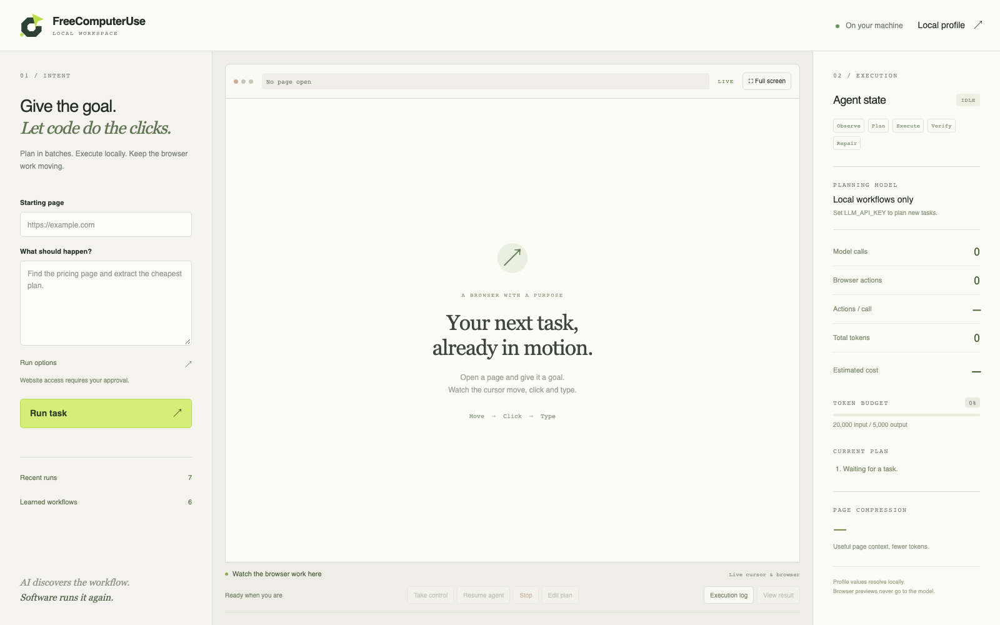
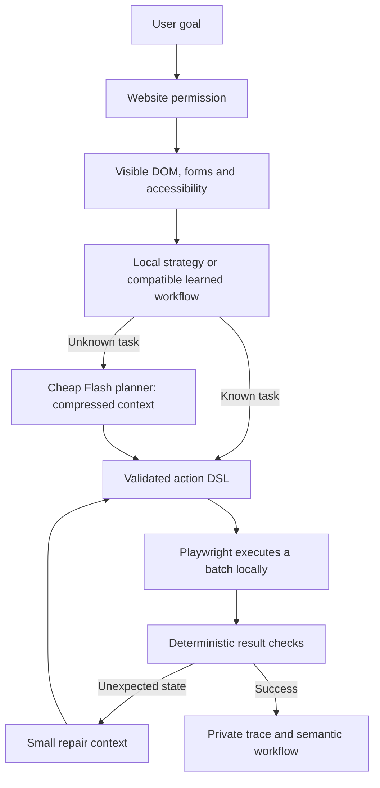

# FreeComputerUse

**An autonomous browser agent that spends tokens on planning, then executes browser actions locally.**

A small Flash model creates a batch of actions. TypeScript and Playwright execute it,
verify the result, and learn a semantic workflow for the next compatible run.
The model is called again for unknown page content or a bounded repair—not after
every click. MIT licensed. Runs locally. Model API usage is separately billed.

[Free public browser lab](https://othmaneblial.github.io/FreeComputerUse/) ·
[Measured results](artifacts/benchmark-public.json) · [Security model](SECURITY.md)



## How it works



Repeated screenshot-and-click loops spend model calls interpreting each browser
step. Here, observation, selectors, form mapping, navigation checks and execution
are local code. Screenshots power the local preview and manual inspection; they
are **not sent to the model**. Visual-only/canvas automation remains planned.

## Install and run

Requires Node **22.13+**, npm and Chromium. Tested on macOS with real Chromium.

```bash
git clone https://github.com/OthmaneBlial/FreeComputerUse.git
cd FreeComputerUse
npm ci
npx playwright install chromium
cp .env.example .env
chmod 600 .env
# Edit .env locally with your API key.
npm run dev
```

Open **http://127.0.0.1:4318**. Enter a starting URL and goal. Approve website
access, then watch the cursor move to controls, click and type into the browser.
The live preview shows progressive typing, click indicators and scrolling alongside
the plan, events, tokens and estimated cost. Cursor coordinates come from local
browser operations; this visual interaction adds no model calls. CLI and benchmarks
keep their fast execution; the dashboard uses a visible pace by default.
The workspace fits the window; approvals stay beside the browser controls.
Use **Full screen** to watch the browser at full size, and **Execution log** to
open its stream in a dialog. Results, history and run options open on demand.
Use **Take control** to pause, click/type manually or edit the plan, then resume.
Completed history entries replay their successful actions without a provider.

Default model configuration:

```dotenv
LLM_API_KEY=
LLM_MODEL=deepseek-flash
LLM_BASE_URL=https://api.deepseek.com
LLM_RESPONSE_FORMAT=json_object
```

The DeepSeek integration explicitly disables thinking mode. Other
OpenAI-compatible endpoints are supported through the provider interface; only
DeepSeek Flash has been validated live here. Optional input/output/cached-input
prices are USD per million tokens. Leave them blank to display unknown cost.
Check [the provider's current prices](https://api-docs.deepseek.com/quick_start/pricing/)
before configuring estimates. Benchmarks use conservative configured peak prices,
not billing receipts.

## Permissions and privacy

**Normal mode asks before the first document request to each website origin.**
New origins need their own permission. Sensitive actions have a separate approval
step; cached workflows and replay keep those gates. Noninteractive CLI runs reject
approval requests rather than silently allowing them.

**Ultra mode is explicit and off by default.** `--ultra` or the UI checkbox skips
website/action approval and permits external HTTP(S) destinations. It retains the
fixed action API, strict validation, token/step limits and upload alias boundary.

The model cannot run shell commands or arbitrary JavaScript. Profile values and
file paths resolve locally through aliases; only alias names are normally sent.
Known values and key-shaped strings are redacted from prompts, logs and saved
traces. Webpage content is marked as untrusted data. Cross-origin requests are
restricted in normal mode, and stale sensitive-action approvals are rejected.

Local `.env`, `.fcu`, sessions, downloads and SQLite history are ignored by Git.
Private files/directories use restricted permissions. **Storage is not encrypted.**
The loopback dashboard uses a session cookie, Host/Origin checks, CSRF protection
and CSP. Sensitive-control detection is heuristic; choose `--confirmation always`
for action-by-action review. See [SECURITY.md](SECURITY.md) for boundaries and limits.

## Try useful tasks on free websites

```bash
# Read-only product comparison on a scraping sandbox.
npm run agent -- run \
  "Extract the full titles and prices of the first five books as structured records" \
  https://books.toscrape.com/

# Synthetic invoice: no real account or payment.
npm run agent -- run \
  "Download the synthetic invoice and verify the download was created" \
  https://othmaneblial.github.io/FreeComputerUse/lab/invoices.html

# A narrow, fully specified task can use local code with zero model calls.
npm run agent -- run "Extract the table" \
  https://othmaneblial.github.io/FreeComputerUse/lab/reports.html

# Debug events and an additional final criterion owned by the user.
npm run agent -- run "Start the delayed content and extract the final visible message" \
  https://the-internet.herokuapp.com/dynamic_loading/1 \
  --debug --expect-text "Hello World!"
```

The [styled task library](https://othmaneblial.github.io/FreeComputerUse/lab/index.html)
has ten sourced real-world research goals and six complex practice workflows.
Product comparison, travel planning and invoice retrieval navigate through
**actual separate pages**, with filters, details, extraction and downloads.
Analytics, preferences and documents cover scoped data and saved state.
Read [the examples guide](docs/USEFUL_EXAMPLES.md) for sources, page sequences,
verification and trial limits. Original focused browser checks remain available.
Job applications are one local illustration, alongside these broader tasks.

## Local profile

Import a JSON file with `npm run agent -- config --profile /absolute/path/profile.json`
or edit **Local profile** in the dashboard:

```json
{
  "profile": {
    "firstName": "Alex",
    "lastName": "Example",
    "email": "alex@example.test",
    "country": "France",
    "message": "A synthetic test message"
  },
  "files": {
    "resume": "/absolute/path/to/your/resume.pdf"
  }
}
```

The planner uses `{{profile.email}}` and `{{files.resume}}`; values resolve in the
runtime. In normal mode the original goal must authorize profile/local-file use.
Uploads accept an explicitly defined file alias, never an arbitrary model path.

## CLI

| Command | Purpose |
| --- | --- |
| `agent run "goal" URL` | Execute a task; persistent session by default |
| `agent open URL` | Headed browser and interactive task prompt |
| `agent inspect URL` | Compressed DOM; `--region`, `--accessibility`, local `--screenshot` |
| `agent replay RUN_ID` | Replay a completed trace with no model calls |
| `agent history` | Local outcomes and run IDs |
| `agent workflows` | Learned semantic workflows and reuse counts |
| `agent config` | Safe configuration status and alias names |
| `agent doctor --api` | Verify Chromium and the configured model endpoint |
| `agent ui` | Start the local dashboard |

From source, prefix commands with `npm run agent --`. After `npm run build`, use
`node dist/cli/index.js` or `npm link` to install the `agent` command locally.
`agent open` accepts `:pause`, `:resume`, `:approve`, `:reject`, `:stop`, `:inspect`
and `:quit`. Run `npm run agent -- run --help` for all task flags.

## Validation and measurements

```bash
npm run check
npm test
npm run build
npm run security
# Optional rendered UI smoke test on the public lab (may spend API tokens):
# npm run ui:smoke
npm run fixtures                 # deterministic local lab, port 3000
npm run demo                     # labeled scripted fixture provider; no LLM
npm run demo -- --live            # real Flash job/contact demo, synthetic local data
npm run benchmark -- --live       # six local scenarios plus learned repeats
npm run benchmark:public          # real Flash on 14 free public scenarios plus repeats
npm run lab:build
npm run lab:serve                 # styled local workspace, port 4319
npm run lab:smoke                 # desktop/mobile render checks, no API spend
npm run benchmark:complex         # authored plans, six complex cases and repeats
npm run benchmark:complex -- --live # real Flash planning on the complex cases
npm run benchmark:real            # read-only GitHub/GOV.UK research trials
```

The public suite is opt-in and spends API tokens. Its harness explicitly approves
only each selected test origin and rejects external sensitive actions. It uses
read-only scraping/automation sandboxes; forms/settings run only in our static
simulation lab. It does not message people, purchase, create accounts or alter a
real account. Every scenario has trusted completion criteria **and an independent
result oracle**. Compatible repeats run with **no provider installed**.

Local real-API demo measurements on 2026-09-18:

| Task | Successful actions | Model calls | Total tokens |
| --- | ---: | ---: | ---: |
| Contact form | 7 | 1 | 1,207 |
| Multi-page job application | 11 | 3 | 4,272 |

These are observed fixture runs in [the demo report](artifacts/demo-measurements.json).
The final public trial passed **14/14** result checks, and **14/14** learned repeats passed with **zero model calls**. First runs used 30 successful actions, 18 calls and 31,654 tokens (configured peak-price estimate: **$0.00611** total). The six local scenarios and their provider-free repeats also passed. See [the measurement method](docs/BENCHMARKS.md).

See [the public benchmark report](artifacts/benchmark-public.json) for task
correctness, calls, tokens, estimated cost, repairs, compression and learned repeat
results. Validation runs only locally with `npm run validate`; GitHub CI is disabled
and its workflow has been removed. The tests cover real Chromium extraction, frames/shadow DOM, selectors,
validation, uploads/downloads, tabs, verification, bounded repair, workflow/replay,
permissions, redaction, token reservations and the rendered dashboard.

**Evidence limits:** these are individual runs on specified test sites, not a
universal success rate. Earlier fixtures deliberately contained large decorative
HTML to exercise compression; the redesigned public lab uses shared styling.
Context reduction varies by page. No screenshot-agent
baseline was measured, so no token/cost savings percentage is claimed.

## Runtime and extension points

| Module | Responsibility |
| --- | --- |
| `src/browser` | Persistent Chromium, visible DOM, refs, ranked selectors, compression/diffs |
| `src/actions` | Strict Zod DSL, normalization, gated Playwright execution |
| `src/verification` | Local URL, text, field, network, download, extraction and tab checks |
| `src/agent` | Observe/plan/execute/verify/repair, human control and budgets |
| `src/llm` | Abstract provider; minimal JSON plan/repair/classify calls |
| `src/profile` | Private local profile and alias resolution/redaction |
| `src/history`, `src/workflows` | SQLite traces and compatible semantic workflow reuse |
| `src/adapters` | Narrow deterministic strategies and optional adapter interface |
| `src/server`, `src/ui` | Loopback workspace, live preview and controls |

The DSL supports navigation, click/double-click, fill/type/select/check/uncheck,
keyboard, hover/scroll, uploads/downloads, tabs, waits, extraction and submission.
Mutations reject ambiguous selectors. Repair preserves successful actions and
replaces only the failed portion. Context can escalate from structured DOM/diffs
to accessibility and a sanitized HTML fragment. Loop and token limits stop
unbounded runs.

Workflow matching currently requires the same origin, path, normalized goal and
compatible initial control structure. It does not claim transfer across unrelated
sites. Failed runs are not automatically replayed. See the
[requirement audit](docs/REQUIREMENTS.md) and [implementation notes](docs/IMPLEMENTATION.md).

## Planned

- Domain adapters for Greenhouse, Lever and other complex platforms.
- Explicit versioned workflow generalization across compatible task parameters.
- Optional vision fallback for canvas and inaccessible DOM; no CAPTCHA bypass.
- Cheap/strong model routing for difficult recovery.
- Encrypted vault storage and more detailed site/data permission scopes.
- Repeated benchmark trials, more sandbox cases and a measured screenshot baseline.

## License

[MIT](LICENSE). Report vulnerabilities privately through
[GitHub vulnerability reporting](https://github.com/OthmaneBlial/FreeComputerUse/security/advisories/new).
