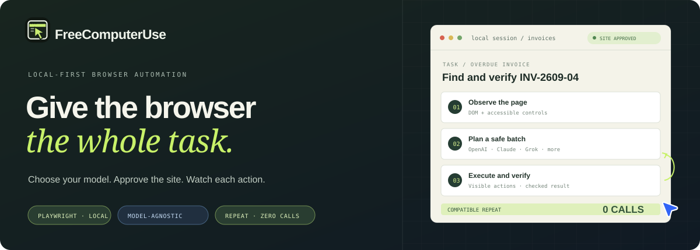
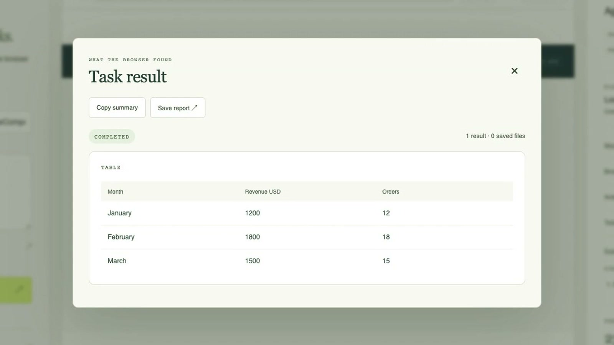
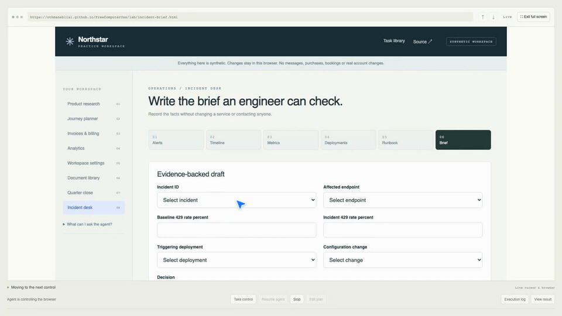

<h1> FreeComputerUse</h1>



<p align="center">
  <a href="LICENSE"></a>
  
  
  
</p>

<p align="center">
  <a href="#quick-start">Quick start</a> ·
  <a href="#watch-a-real-run">Demo video</a> ·
  <a href="https://github.com/OthmaneBlial/FreeComputerUse/releases/latest">GitHub release</a> ·
  <a href="https://othmaneblial.github.io/FreeComputerUse/">Project site</a> ·
  <a href="https://othmaneblial.github.io/FreeComputerUse/lab/index.html">Try the task lab</a> ·
  <a href="SECURITY.md">Security</a>
</p>

**Your browser. Your model. Your call.** Tell it what done looks like, then stay in control of every step.

FreeComputerUse is a local-first AI browser automation agent. A model plans small action batches; TypeScript and Playwright execute and verify them in your browser. Compatible workflows can be learned once and replayed later with **zero model calls**.

## Watch a real run

[](assets/readme/product-demo.mp4)

[Watch the 22-second product demo](assets/readme/product-demo.mp4) · [Watch the short portrait cut](assets/readme/product-demo-portrait.mp4)

The video shows the npm install command, the local dashboard, explicit site approval and a verified result. It uses the public synthetic practice task: three rows, one browser action and zero model calls. That task is deterministic and does not claim general website success.

[](https://othmaneblial.github.io/FreeComputerUse/#watch)

One goal led through six pages to a verified incident brief: **21 successful actions, 10 model calls, one repaired failure**. The configured cost estimate was **$0.00650**. This is one recorded synthetic task, not a general success-rate claim. [Watch the full recording](https://othmaneblial.github.io/FreeComputerUse/lab/media/incident-demo.mp4) · [Inspect the evidence](assets/readme/incident-evidence.json).

## How it works

1. **Observe** the page’s DOM and accessible controls.
2. **Plan** a bounded batch with the model you choose.
3. **Execute** browser actions locally with Playwright; direct navigation to a new origin asks for approval.
4. **Verify** results, repair only what failed, then reuse compatible learned workflows.

The model does not run shell commands or arbitrary JavaScript. Browser previews stay local; the goal and selected page context are sent to your configured model provider.

## Quick start

Requires **Node.js 22.13+**, npm and an installed browser. The verified setup is macOS 26.6 (Apple Silicon), Node 25.9.0 and system Chrome 154.0.8037.57; the complete serial validation passed on this combination. The declared Node minimum and other OS/browser combinations remain unverified. This setup selects installed Chrome and avoids a separate Playwright browser download; see the [support matrix](docs/SUPPORT_MATRIX.md) for exact coverage and limits.

### Install from npm

```bash
npm install --global free-computer-use@0.1.0
FCU_BROWSER_CHANNEL=chrome agent doctor
FCU_BROWSER_CHANNEL=chrome agent ui
```

Open **http://127.0.0.1:4318**. The practice revenue-table task works without a model key. For model-planned tasks, configure a provider as described in [Pick your model](#pick-your-model).

### Run from source

```bash
git clone https://github.com/OthmaneBlial/FreeComputerUse.git
cd FreeComputerUse
npm ci
cp .env.example .env
chmod 600 .env
```

Set `FCU_BROWSER_CHANNEL=chrome` in `.env` to use the verified installed-Chrome path without downloading a browser binary.

For model-planned tasks, configure a provider in `.env`. The browser sandbox task below works without a model key:

```dotenv
FCU_BROWSER_CHANNEL=chrome
LLM_PROVIDER=openai-compatible
LLM_API_KEY=your-key
LLM_BASE_URL=https://api.deepseek.com
LLM_MODEL=deepseek-flash
```

```bash
npm run agent -- doctor
npm run dev
```

Open **http://127.0.0.1:4318**, enter a starting URL and goal, then approve site access.

**Try it without an API key:** open [the practice revenue table](https://othmaneblial.github.io/FreeComputerUse/lab/reports.html) and run the goal `Extract the table`. This narrow workflow has a deterministic local strategy; general tasks need a model provider.

## Troubleshooting

- **The browser does not start:** install Chrome, set `FCU_BROWSER_CHANNEL=chrome` in `.env`, then run `npm run agent -- doctor`. See the [verified platform limits](docs/SUPPORT_MATRIX.md); other OS/browser combinations are not certified here.
- **The dashboard says no model is configured:** the practice revenue-table task works without a provider. For model planning, configure one route from [Pick your model](#pick-your-model). `npm run agent -- doctor --api` makes an opt-in request to the configured provider; use it only when you want that network check.
- **A site is blocked or asks for approval:** normal mode asks before a new origin and blocks private/reserved DNS answers. Approve only the site needed for the task. Ultra mode disables those protections; do not use it as a workaround for a blocked destination.
- **The run finishes without proving the goal:** inspect the result checks and use a narrower goal. Browser clicks alone do not mean the requested outcome was verified.
- **You need to find or remove local data:** see [local storage, export, retention and deletion](docs/LOCAL_DATA.md). Data is not encrypted and is not automatically expired.

## Pick your model

Use a provider API key, or sign in through the official CLI for a supported subscription. API usage and consumer subscriptions are separate billing products.

| Provider | Configuration |
| --- | --- |
| OpenAI, xAI Grok, DeepSeek, Mistral or another OpenAI-compatible API | `LLM_PROVIDER=openai-compatible`; set `LLM_API_KEY`, `LLM_MODEL` and `LLM_BASE_URL` |
| Google Gemini API | OpenAI-compatible mode with `LLM_BASE_URL=https://generativelanguage.googleapis.com/v1beta/openai/` and your Gemini API key |
| OpenRouter | OpenAI-compatible mode with `LLM_BASE_URL=https://openrouter.ai/api/v1` and the chosen `provider/model` slug |
| Anthropic API | `LLM_PROVIDER=anthropic`; set `LLM_API_KEY` and `LLM_MODEL` |
| ChatGPT plan | Install Codex CLI, sign in with `codex login`, set `LLM_PROVIDER=codex-subscription` |
| Claude Pro/Max plan | Install Claude Code 2.1.248+, sign in with `claude auth login` (not Console), set `LLM_PROVIDER=claude-subscription` |

The provider API routes have not all been live-tested here; DeepSeek Flash is the measured default. Subscription modes use the local CLI sign-in, need no API key and respect plan limits. Their local agent tools and MCP servers are disabled while planning. See [provider setup and limits](docs/PROVIDERS.md), the [support matrix](docs/SUPPORT_MATRIX.md) and [.env.example](.env.example) for route-specific setup, tests and live-evidence status.

## Connect an MCP host

Run FreeComputerUse as a local MCP server over `stdio` with `agent mcp`. It
provides tools to start a task, inspect the observed page, follow and verify the
result, and stop a task. Site and sensitive-action approvals still require a
human response in an MCP host that supports form elicitation. No HTTP endpoint
is opened. See the [MCP setup and validation limits](docs/MCP.md). The separate
provider CLI adapters keep their own tools and MCP disabled while planning.

## FAQ

**Can I try it without a model key?** Yes, the practice revenue-table workflow runs with a deterministic local strategy. General tasks need a configured model.

**Which providers have live evidence?** The current matrix records DeepSeek Flash and one synthetic plan through Codex CLI `0.156.1` with ChatGPT. Contract tests do not certify a live provider; see the [dated support matrix](docs/SUPPORT_MATRIX.md).

**Does the model receive screenshots or browser profiles?** No screenshots are sent. The task and selected page context go to your provider; browser execution, profiles, history and downloads stay local. Local data is not encrypted.

**Which platform is verified?** macOS 26.6 on Apple Silicon, Node 25.9.0 and system Chrome 154. Other OS, Node and browser combinations remain unverified in the [support matrix](docs/SUPPORT_MATRIX.md).

## Control and privacy

- Normal mode asks before direct navigation to a new origin and blocks hostnames resolving to private or reserved address ranges, including private IPv4 embedded in a discovered NAT64 prefix. A loopback-only proxy connects to the vetted numeric address, closing the DNS lookup-to-connection rebinding gap for browser HTTP(S) and WebSocket traffic. Explicit IP destinations require an exact origin grant. Ultra mode and the low-level `allowExternal` option opt out of origin and private-address checks. Chrome 154 tests cover redirect denial, simulated DNS rebinding, approved/blocked plain WebSockets, and approved/blocked browser-originated WSS. The WSS fixture uses a generated local certificate and ignores its certificate error only in the test; a separate opt-in smoke verifies Chrome TLS and an echo against one public WSS endpoint. Other WSS endpoints, live network-specific NAT64 discovery and other browser builds remain unverified. Sensitive actions have a separate confirmation gate. Ultra mode is explicit and off by default.
- Browser execution, profiles, history and downloads stay on your machine. Page context needed for a plan goes to the chosen model provider; screenshots are not sent.
- The planner receives aliases for local profile and file values, not their contents. Local storage is **not encrypted**.
- Chromium profiles disable WebRTC UDP that the proxy cannot carry. Sites needing direct UDP for voice/video may fail; one local Chrome STUN fixture confirms no direct packet reached its receiver. Other non-HTTP traffic remains unverified.
- Runs record actions, checks, repairs, token estimates and workflow reuse so you can inspect what happened.

Read [the security boundaries](SECURITY.md) before using personal or sensitive data.
See [where local data is stored and how to inspect, export or delete it](docs/LOCAL_DATA.md).

## Evidence

In a focused public suite recorded **18 September 2026**, 14/14 first-run results and 14/14 compatible learned repeats passed independent checks. First runs used 18 model calls; repeats used zero. These single-trial sandbox results do not predict success on arbitrary websites. [Report](artifacts/benchmark-public.json) · [Method and limitations](docs/BENCHMARKS.md).

## Explore and contribute

- [Project site and task library](https://othmaneblial.github.io/FreeComputerUse/)
- [Frequently asked questions](https://othmaneblial.github.io/FreeComputerUse/#faq)
- [Useful browser-task examples](docs/USEFUL_EXAMPLES.md)
- [Implementation notes](docs/IMPLEMENTATION.md)
- [Architecture](docs/ARCHITECTURE.md)
- [Local validation commands](docs/LOCAL_VALIDATION.md)
- [Contributing](CONTRIBUTING.md) · [Changelog](CHANGELOG.md)

Useful contributions: reproducible browser tasks, safer permission scopes and checks that make results easier to trust. Keep shared examples synthetic or read-only; remove credentials and personal data from traces.

[MIT License](LICENSE) · Built with TypeScript and Playwright.
