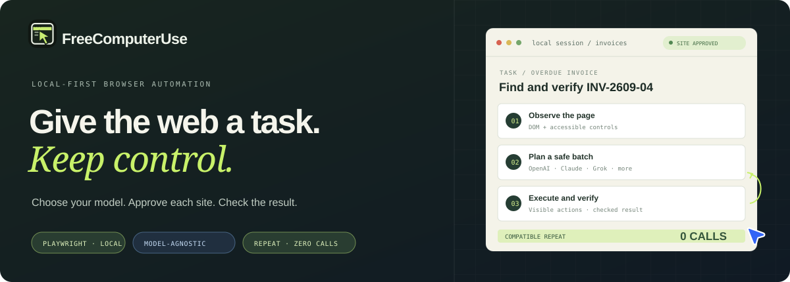
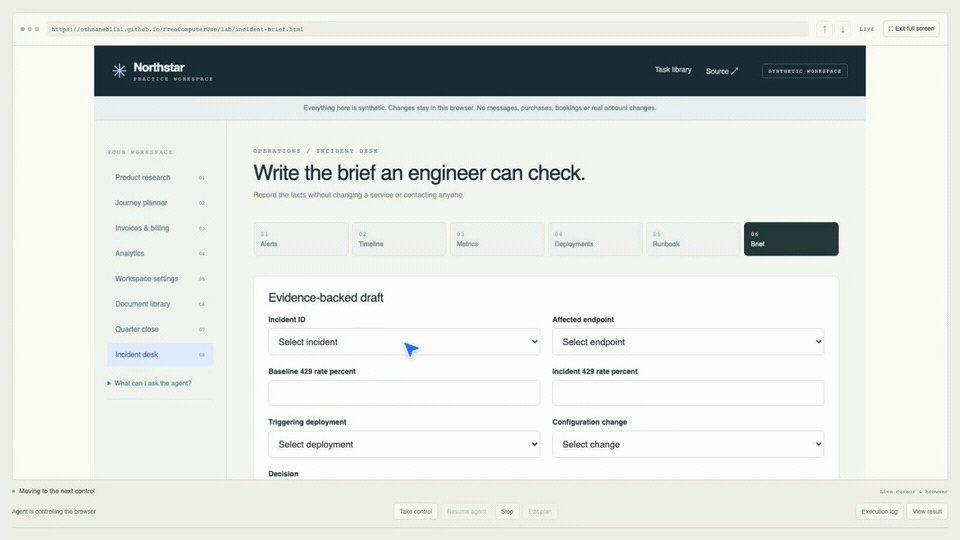

# FreeComputerUse



<p align="center">
  <a href="https://www.npmjs.com/package/free-computer-use"></a>
  <a href="https://github.com/OthmaneBlial/FreeComputerUse/releases/latest"></a>
  <a href="LICENSE"></a>
  
</p>

<p align="center">
  <a href="#quick-start">Quick start</a> ·
  <a href="#try-it-without-a-model-key">Try it free</a> ·
  <a href="#watch-it-work">Watch a run</a> ·
  <a href="https://othmaneblial.github.io/FreeComputerUse/">Project site</a> ·
  <a href="https://github.com/OthmaneBlial/FreeComputerUse/releases/latest">Latest release</a>
</p>

**Give the web a task. Keep control of the work.** FreeComputerUse is an open-source browser agent that plans with the model you choose and drives Playwright on your machine. Approve site access, review sensitive actions, and check the evidence behind each result.

## Quick start

Requires Node.js 22.13+, npm, and an installed browser. This verified setup uses system Chrome and does not download a separate browser.

```bash
npm install --global free-computer-use@0.2.23
FCU_BROWSER_CHANNEL=chrome agent doctor
FCU_BROWSER_CHANNEL=chrome agent ui
```

Open **http://127.0.0.1:4318**. Start with a built-in task or add a provider for open-ended work.

## Try it without a model key

Enter one of these goals in the dashboard:

| Goal | What you get |
| --- | --- |
| `Read the page` | Visible page text |
| `Extract the links` | Link labels and URLs |
| `Extract the first 5 links` | A verified, bounded link list |
| `Extract the table` | Three rows from the [practice revenue table](https://othmaneblial.github.io/FreeComputerUse/lab/reports.html) |

These local strategies make zero model calls. They are narrow page-reading jobs; general browsing tasks need a configured model.

## Watch it work

[](https://othmaneblial.github.io/FreeComputerUse/lab/media/incident-demo.mp4)

One recorded synthetic task followed six pages and saved a checked incident brief: 21 successful actions, 10 model calls, and a configured cost estimate of $0.00650. This is a single example, not a general success-rate claim. [Watch the full run](https://othmaneblial.github.io/FreeComputerUse/lab/media/incident-demo.mp4) · [Inspect its evidence](assets/readme/incident-evidence.json).

## How it works

1. Read page structure and accessible controls.
2. Ask your selected provider for a small, typed action batch.
3. Run actions locally with Playwright. Direct navigation to a new site asks for approval.
4. Check the result, repair bounded failures, and reuse a compatible workflow when its completion conditions still hold.

The model cannot run shell commands or arbitrary JavaScript. Browser profiles, execution, history, and downloads stay on your machine. Your task and selected page context go to the provider you choose; screenshots are not sent.

## New in 0.2.23

URL query and fragment values named `state`, `nonce`, `csrf`, `xsrf` or `sid` are
now redacted before provider prompts, saved traces, and CLI/dashboard history
output. The browser still opens the original URL; ordinary values such as search
terms remain visible.

[Read the full 0.2.23 release notes](https://github.com/OthmaneBlial/FreeComputerUse/releases/tag/v0.2.23).

## Choose a model

Use an API key or authenticate through a supported provider CLI. API usage and consumer subscriptions have separate billing and limits.

| Route | Setup |
| --- | --- |
| OpenAI, Grok, DeepSeek, Mistral, Gemini, or OpenRouter | Configure `LLM_PROVIDER=openai-compatible`, `LLM_BASE_URL`, `LLM_MODEL`, and `LLM_API_KEY` |
| Anthropic API | Configure `LLM_PROVIDER=anthropic`, `LLM_MODEL`, and `LLM_API_KEY` |
| ChatGPT plan | Sign in with Codex CLI, then set `LLM_PROVIDER=codex-subscription` |
| Claude Pro/Max plan | Sign in with Claude Code 2.1.248+, then set `LLM_PROVIDER=claude-subscription` |

Some provider routes have contract tests but no live test. Check the dated [support matrix](docs/SUPPORT_MATRIX.md) and [provider setup guide](docs/PROVIDERS.md) before choosing a route.

## Use with an MCP host

Run `agent mcp` to expose four bounded tools over local `stdio`: start, inspect, follow, and stop a browser task. `follow` returns completion checks. Site and sensitive-action approvals still need a human response in a host that supports form elicitation. No HTTP endpoint is opened. See [MCP setup and limits](docs/MCP.md).

## Privacy and security

- Browser execution, profiles, history, and downloads stay local. The selected task and page context go to your model provider. Screenshots are not sent.
- Normal mode asks before moving to a new site and blocks connections to private and reserved addresses. Ultra mode is opt-in and skips those origin checks.
- Sensitive actions have a separate approval step. Detection relies on heuristics and cannot identify every deceptive page.
- Local data is not encrypted and does not expire automatically. See [data storage and deletion](docs/LOCAL_DATA.md) and the [security boundaries](SECURITY.md) before using personal data.
- Browser profiles disable WebRTC UDP that the network proxy cannot carry. Sites requiring direct UDP for voice or video may fail.

## Evidence and support

The current full local gate covers TypeScript, the test suite, the build, a credential-pattern scan, and the production dependency audit. Current environment and platform limits are recorded in the [support matrix](docs/SUPPORT_MATRIX.md). Tests do not certify an untested provider, browser, operating system, or real website.

The public task suite measured on 18 September passed 14 first runs and 14 compatible repeats in that single trial. Repeats made zero model calls. These synthetic and public-web measurements do not predict success on arbitrary sites. See the [report](artifacts/benchmark-public.json) and [method limits](docs/BENCHMARKS.md).

## Run from source

```bash
git clone https://github.com/OthmaneBlial/FreeComputerUse.git
cd FreeComputerUse
npm ci
cp .env.example .env
chmod 600 .env
```

Set `FCU_BROWSER_CHANNEL=chrome` in `.env`. For model-planned tasks, configure the provider described in [`.env.example`](.env.example), then run:

```bash
npm run agent -- doctor
npm run dev
```

Run the full local checks with `FCU_BROWSER_CHANNEL=chrome npm run validate`. No provider key is required for that gate.

## Project links

- [Product site and task library](https://othmaneblial.github.io/FreeComputerUse/)
- [Latest GitHub release](https://github.com/OthmaneBlial/FreeComputerUse/releases/latest)
- [Useful browser-task examples](docs/USEFUL_EXAMPLES.md)
- [Architecture](docs/ARCHITECTURE.md) · [local data](docs/LOCAL_DATA.md) · [local validation](docs/LOCAL_VALIDATION.md)
- [Contributing](CONTRIBUTING.md) · [Changelog](CHANGELOG.md)

Useful contributions include reproducible tasks, safer permission scopes, and checks that make results easier to trust. Keep examples synthetic or read-only; never include credentials or personal data in traces.

[MIT License](LICENSE) · Built with TypeScript and Playwright.
