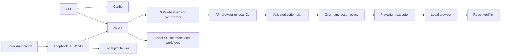

# Architecture

FreeComputerUse is a local Node.js process. The model proposes bounded browser
actions; the local policy and executor decide whether and how those actions run.
There is no hosted application server or background cloud sync in this design.

## Request path

1. `src/cli/index.ts` loads environment configuration and starts a task, the
   local dashboard, or a diagnostic. `src/config.ts` resolves provider settings,
   token limits and the dedicated local data directory.
2. `src/agent/Agent.ts` coordinates observation, planning, execution, repair,
   independent completion checks and trace updates. `Control` carries approval,
   pause, resume and stop signals.
3. `Observer`, `DomExtractor` and `PageCompressor` collect a bounded DOM-based
   page description. `LLMProvider` adapters return a structured plan; Zod
   schemas validate it before `Executor` can act.
4. `policy.ts` applies site-origin and sensitive-action rules. `Browser.ts`
   attaches Chromium request guards, and `NetworkGuardProxy.ts` checks proxied
   HTTP(S)/WebSocket destinations. `Executor` performs the fixed action set;
   it does not evaluate model-supplied JavaScript or shell commands.
5. `Verifier` checks task-specific completion evidence. `WorkflowEngine` stores
   compatible learned workflows and replays them without another model request,
   while retaining the regular permission checks.

## Local surfaces and data

- `src/server/index.ts` serves the dashboard only on loopback and checks its
  session cookie, Host, Origin and CSRF token. `src/ui/` contains the browser UI.
- `ProfileStore` stores explicitly configured aliases; `TraceStore` stores run
  history and learned workflows in SQLite. Browser profiles and downloads use
  the same configured data directory. Details, retention and deletion are in
  [Local data](LOCAL_DATA.md).
- API mode sends the page context needed to plan to the selected provider.
  Subscription modes invoke the corresponding local provider CLI. Provider
  routes and evidence are in [Providers](PROVIDERS.md) and the
  [support matrix](SUPPORT_MATRIX.md).
- `lab/` is a set of deterministic local practice pages. `docs/` is the GitHub
  Pages source and contains the public landing page and lab copy. It is not the
  agent runtime.

## Change boundaries

Changes to a trust boundary need negative tests plus a matching allowed-path
test. Changes to a provider need contract tests and updated support evidence.
Changes to local storage need import-failure, permission and cleanup checks.
Run `npm run check` for types and `npm run validate` for the complete local
gate; the validation policy intentionally does not use GitHub Actions.
